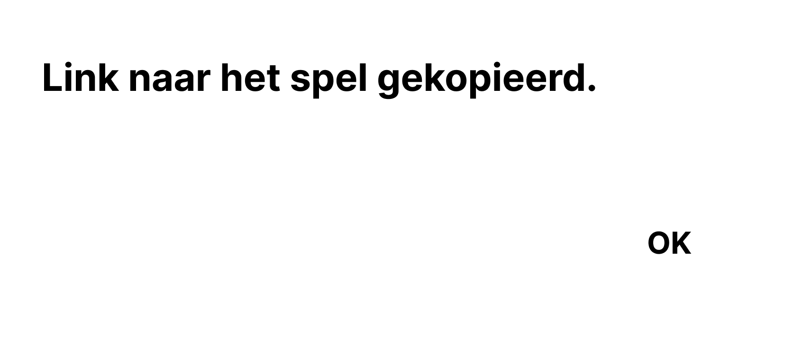
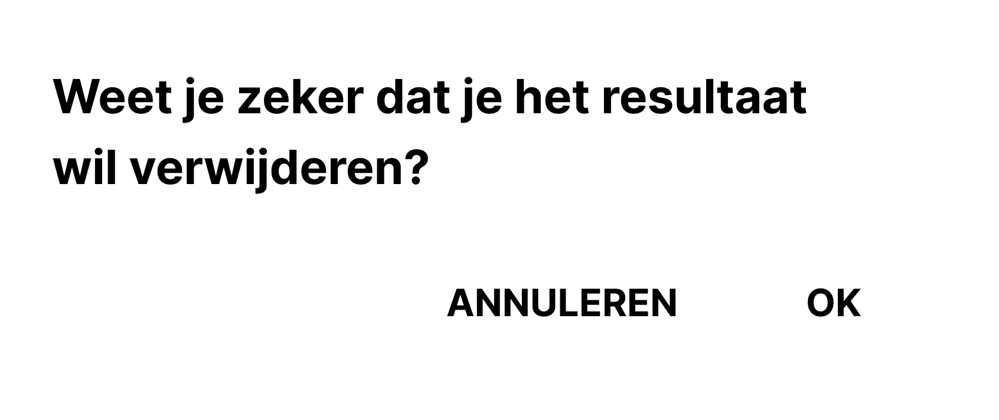
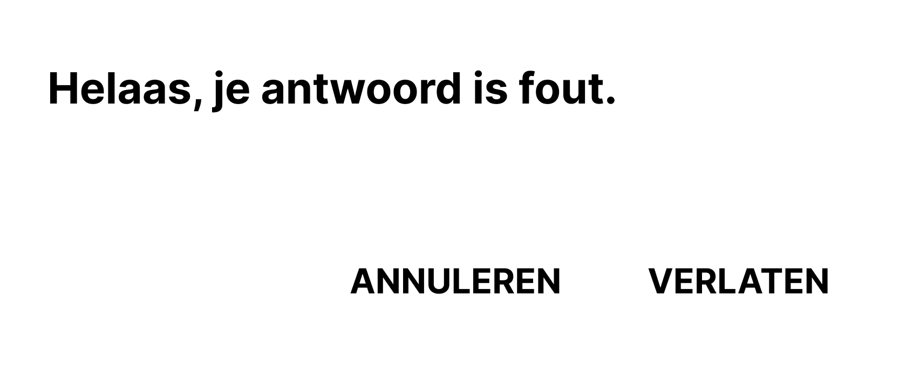
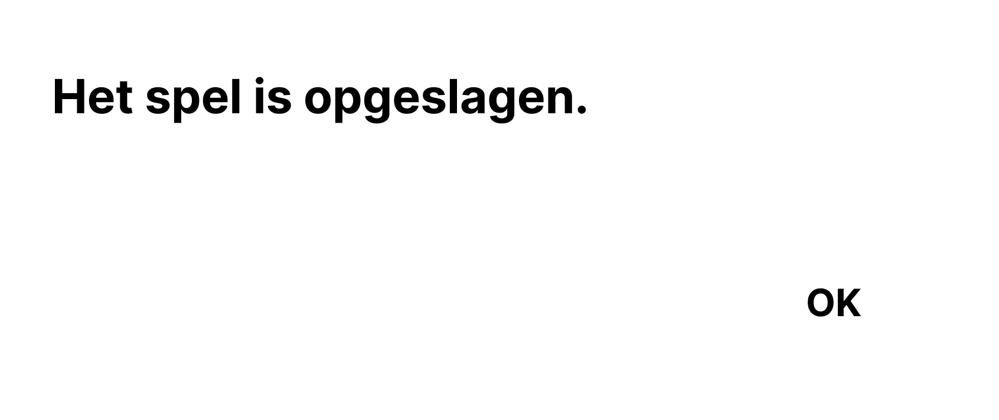
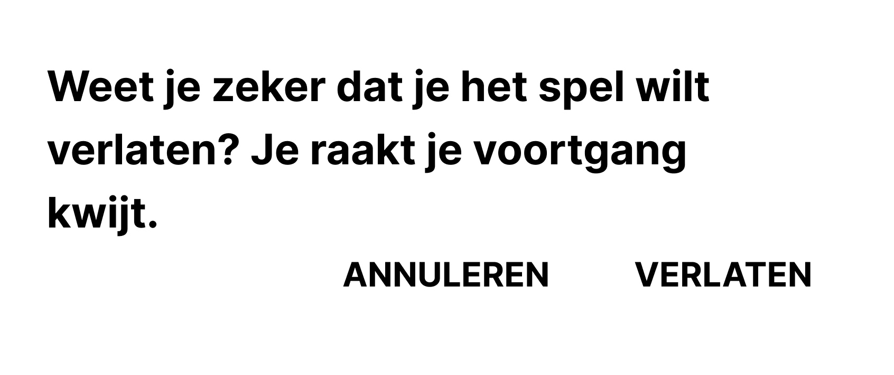
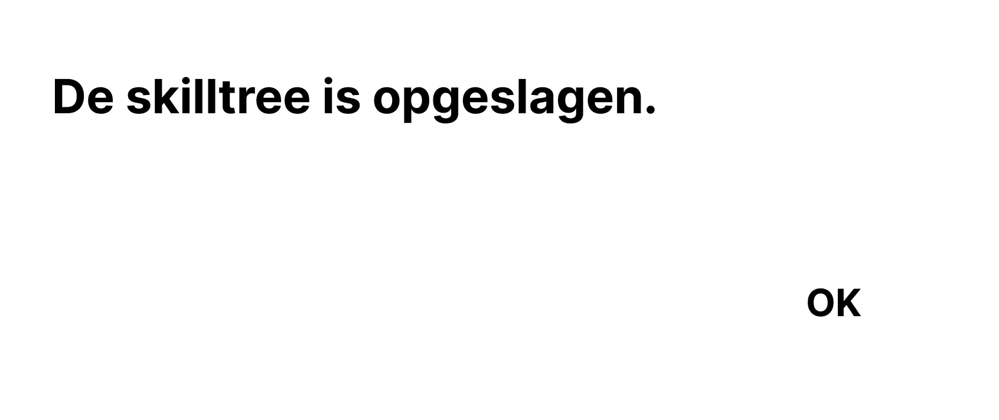
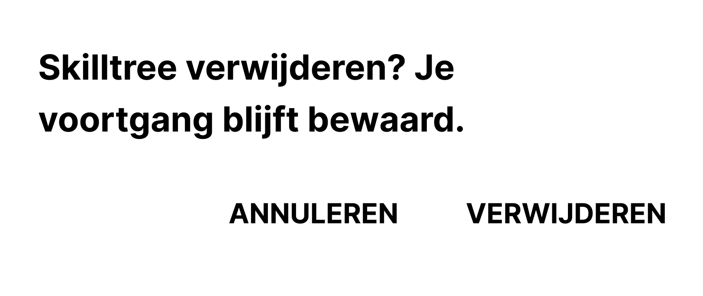
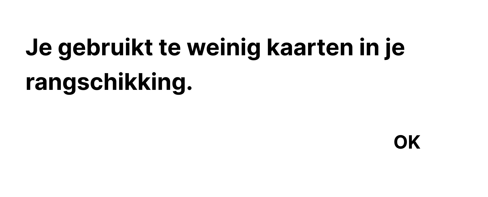
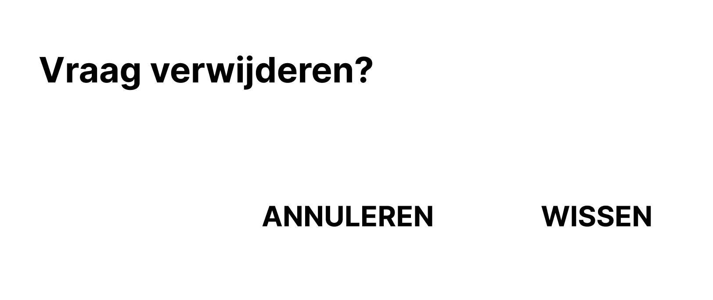
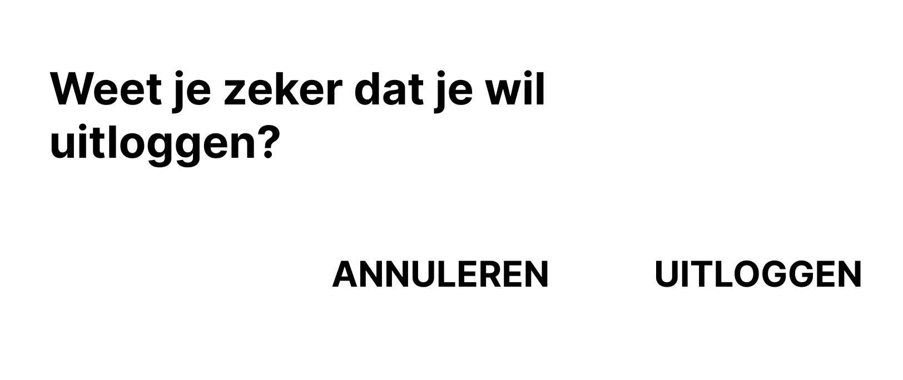

# Dialogs

##### Melding link gekopieerd

##### Melding reslutaat verwijderen

##### Melding fout antwoord

##### Melding spel opgeslagen

##### Melding spel verlaten

##### Melding skilltree opgeslagen

##### Melding skilltree verwijderen

##### Melding te weinig kaarten

##### Melding categorie verwijderen

##### Melding kaart verwijderen

##### Melding tegel verwijderen

##### Melding vraag verwijderen

##### Melding uitloggen

